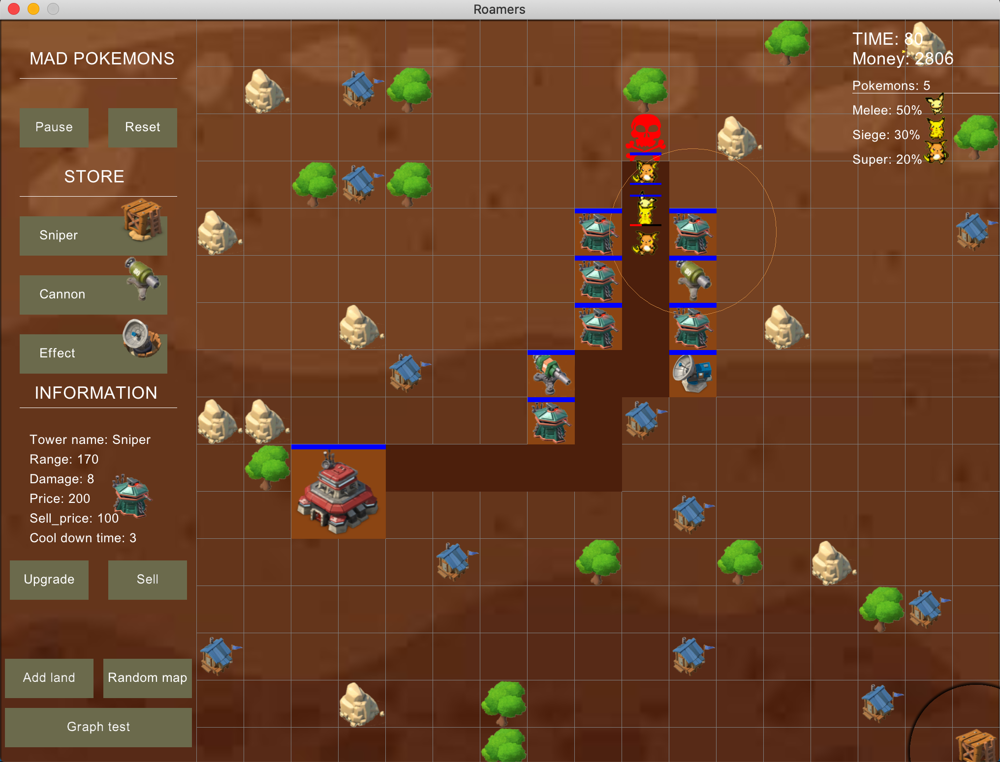

Simple tower defence game that uses the Gosu Ruby library.

# Running

You'll need the gosu gem:
\$ gem install gosu

Then run the main file:
\$ruby start.rb

# UI

# Game play idea

Great thank for xithiox
https://xithiox.github.io/towerdefense/ Live Demo: https://github.com/xithiox/towerdefense

# Creep asset

Thank to lautarodragan
https://github.com/lautarodragan/js-sprite-demo Live Demo : http://lautarodragan.github.io/js-sprite-demo/index.htm

# Moving object in gosu (fixed path)

Thank to lucascaton
https://github.com/lucascaton/alien_invasion

# Tower and terrain asset

https://boombeach.fandom.com/wiki
